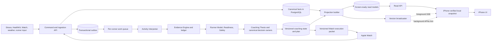

# Faff backend, data, brain, and app architecture brief

**Status:** proposed canonical direction for review and implementation  
**Date:** 2026-09-15  
**Scope:** production backend, PostgreSQL data, coaching brain, iPhone, and Apple Watch. The web frontend remains out of scope.  
**Purpose:** define how the whole system should accept data, turn it into coaching truth, deliver it to the apps, stay fast under load, and prove that the runner is seeing current information.

**Execution order:** [ASAP-IMPLEMENTATION-SEQUENCE.md](./ASAP-IMPLEMENTATION-SEQUENCE.md)

**Post-audit execution control (2026-09-15):** the direction in this brief was
audited against clean `origin/main` and the production schema. Execute it using
[WHOLE-BACKEND-MASTER-PLAN-AUDIT-2026-09-15.md](./WHOLE-BACKEND-MASTER-PLAN-AUDIT-2026-09-15.md)
and
[BACKEND-IMPLEMENTATION-SCOPE-AND-SETUP-2026-09-15.md](./BACKEND-IMPLEMENTATION-SCOPE-AND-SETUP-2026-09-15.md).
The audit adds BA-00 for automated migrations/workload foundations, requires a
BA-01 repair release, and splits BA-02/BA-03 into independently releasable
steps. Those controls supersede the earlier coarse execution sequence where
they are more specific; the target architecture below remains unchanged.

This brief defines the target architecture. It does not claim the current implementation already meets it. The incident record and current-source audit are inputs; they are not substitutes for this design.

## The decision in normal English

The app is slow and unreliable because opening it can currently cause a large number of expensive requests at once. Each request may rebuild much of the same answer through dozens of database reads. The phone then tries to decide for itself which pieces are fresh, using several separate systems that can disagree. This is why more database connections and individual bug fixes have not solved the experience.

The backend should do the hard work once, when the underlying evidence changes. It should save a versioned, screen-ready view of the runner's current state and actively signal the phone when that version changes. The iPhone should open immediately from its last verified copy, maintain a lightweight live update channel while it is active, receive background version hints when iOS permits them, and download one updated snapshot or small change set only when needed. Moving between past and future days should read a date range already held locally, not launch a new server computation for every day.

The coaching brain remains the only authority for coaching decisions. PostgreSQL remains the durable source of facts. A read model is a rebuildable copy prepared for fast display; it is never a second coaching authority. The iPhone is a faithful, resilient display with a local replica. The Watch is the execution partner with a versioned workout packet and reliable upload. Neither app invents training truth.

This should be built as a **modular monolith with separate workloads**, not as a fleet of microservices. Keep one codebase and one primary database while separating interactive reads, writes, brain processing, projections, and background jobs by explicit contracts and resource budgets. That fixes the real failure shape without replacing every working part of the system.

## Why this is necessary

The 2026-09-15 investigation established the following against a real device, correlation IDs, production logs, and source:

- Ordinary navigation triggered roughly three weeks of individual day reads plus four overlapping week reads.
- Approximately twelve requests ran together. A Today request can perform roughly 35–40 sequential database operations.
- The live application pool reached 32 of 32 connections during the reproduced failure.
- Database checkout can wait for 10 seconds while the phone abandons the request after 12 seconds. The phone can therefore time out before the server returns its structured failure.
- The iPhone has at least nine independently owned freshness, cache, invalidation, connection, and single-flight mechanisms.
- The hot runner routes named in the incident do not have a shared, authoritative read model; repeated requests recompute overlapping answers.
- Interactive traffic and most scheduled work use the same application process and pool without a workload-wide concurrency budget.
- Some caught-and-returned server failures do not reach the durable failure recorder.

The detailed evidence is in [ARCHITECTURE-PROPOSAL.md](./ARCHITECTURE-PROPOSAL.md), [01-api-data-fetching-patterns.md](./research/01-api-data-fetching-patterns.md), [02-cron-background-jobs.md](./research/02-cron-background-jobs.md), and [03-native-client-caching-architecture.md](./research/03-native-client-caching-architecture.md). Branch-sensitive numbers must be rechecked against `origin/main` before implementation. The production incident's 32/32 observation is evidence from the deployed environment; a stale audit checkout still contains the earlier pool value and must not be mistaken for production state.

## Non-negotiable outcomes

1. **The runner sees a useful screen immediately.** App launch and date navigation do not wait on the coaching brain or a chain of live database queries.
2. **Displayed truth is identifiable.** Every snapshot carries the server version and generation time that produced it. Cached content is never silently presented as newly confirmed.
3. **The system converges quickly.** After a run, feedback, health update, race edit, or accepted plan change, the backend produces the affected new state and the app obtains it without a manual retry.
4. **Normal use cannot create an accidental denial of service.** One phone, one runner, one background job, or one retry loop cannot consume all shared capacity.
5. **The brain has one route to every coaching decision.** API routes, projections, iPhone code, and Watch code cannot calculate rival answers.
6. **Writes are provable end to end.** The system can show that a command was accepted, stored, interpreted, incorporated into a brain version, projected, delivered, and displayed.
7. **The design works per runner from the beginning.** Isolation, fairness, versioning, idempotency, and load tests are multi-user concerns, even while David is the only production runner.
8. **Failure is quiet when the runner can still act.** Technical failures remain visible to operators. The UI uses the last safe snapshot where possible and interrupts the runner only when the failure changes what they can trust or do.
9. **Build for scale; provision for actual demand.** The contracts, data isolation, queues, caches, and workload boundaries must scale without redesign. Production does not need to run expensive excess capacity before real usage requires it.

## Authority model

The architecture must preserve the ownership rules in [BRAIN_CONSTITUTION.md](../docs/BRAIN_CONSTITUTION.md) and [PRODUCT_COACHING_DOCTRINE.md](../docs/PRODUCT_COACHING_DOCTRINE.md).

| Layer | Owns | Must never own |
|---|---|---|
| Source adapters | Receiving Strava, HealthKit, Watch, weather, race, profile, and runner-feedback payloads | Fitness, readiness, workout meaning, or plan decisions |
| Canonical fact store | Durable facts, source identity, provenance, timestamps, corrections, and consent | Screen composition or duplicate coaching logic |
| Activity Interpreter | What happened in an activity | What it means for fitness or the plan |
| Evidence Engine and ledger | What the activity or health signal proves, with confidence and context | Plan mutation or UI copy |
| Runner Model | Current belief about capacity, durability, load tolerance, and confidence | Goal aspiration or screen-specific overrides |
| Readiness and Safety | Today's modulation and hard constraints | General fitness or independent plan generation |
| Coaching Thesis | The current coaching direction and rationale | Raw-data repair or UI state |
| Plan, Pace, Adaptation, Goal, and Race owners | Their respective canonical decisions and proposals | Separate answers inside API routes or clients |
| Projection builder | Packaging canonical outputs into fast read models | Recomputing or altering a coaching decision |
| API | Authentication, authorization, commands, queries, versions, and delivery | Feature-specific coaching calculations |
| iPhone | Immediate presentation, local verified replica, user intent, and interaction | Deciding fitness, readiness, plan truth, or freshness through multiple local policies |
| Watch | Executing a specific versioned workout and recording what happened | Rebuilding or independently adapting the plan |

The test is simple: if two places can answer the same coaching question, the architecture is wrong. A projection can copy an answer. It cannot create one.

## The target system



### One codebase, four workloads

The first implementation should remain one deployable codebase with four explicit runtime workloads:

1. **Interactive read API.** Serves already-built snapshots and small direct fact lookups. It receives reserved capacity and has the tightest latency budget.
2. **Command API.** Accepts uploads and runner actions, validates them, writes facts plus an outbox event atomically, and returns a receipt quickly.
3. **Brain and projection worker.** Consumes per-runner events, interprets evidence, updates canonical decisions, and rebuilds affected projections. It never blocks an app screen request.
4. **Scheduled and maintenance worker.** Runs weather enrichment, sync sweeps, cleanup, audits, and other background work under a lower-priority budget.

These workloads may initially share PostgreSQL and repository code. Interactive and background work must not share an uncontrolled connection budget. A separate process or deployment for workers is preferred because a runaway sweep then cannot starve Today reads. Resource separation matters more than service count.

### Scale-ready does not mean scaled-up today

Use **1,000 concurrently active runners**, **5,000 connected devices**, and a **2,000-active-runner burst** as the architectural and synthetic load-test envelope. These numbers define what the contracts must be capable of reaching without replacing the data model, brain pipeline, projection system, API, or client synchronization model.

They do not authorize or require production infrastructure sized for those numbers now. Start with the smallest deployment that meets the latency, resilience, and headroom objectives for current measured demand. Increase replicas, worker capacity, database capacity, or shared-cache infrastructure only when production evidence reaches agreed scaling thresholds. Every change that increases recurring service cost remains a separate spend decision requiring David's advance approval.

The system therefore needs:

- stateless interactive API instances that can be replicated later;
- no process-local state required for correctness;
- a broadcaster and cache design that can move to shared infrastructure without changing app contracts;
- per-runner work ownership that remains correct across multiple workers;
- connection budgets expressed per workload and deployment, not hidden constants based on one server;
- dashboards showing when measured demand justifies the next capacity step.

## The complete lifecycle

### 1. A source sends new information

Every incoming write is a named command: `RecordRunCompletion`, `ImportHealthSamples`, `RecordRunnerFeedback`, `UpdateRace`, `AcceptPlanChange`, or similar. Commands express intent instead of exposing arbitrary row updates.

Every command carries:

- authenticated `user_id` derived on the server;
- an idempotency key stable across client retries;
- source and source-record identity;
- event time and received time;
- schema version;
- device/app version where applicable;
- trace ID;
- the last server version the client had seen, when relevant.

The server validates the payload, deduplicates it, and stores the canonical fact and an outbox event in the same database transaction. The response does not wait for the whole brain to rerun.

### 2. The server returns a write receipt

The response states one of:

- `accepted`: the fact is durable and downstream processing is pending;
- `applied`: the resulting projection version is already available;
- `duplicate`: this exact write was already accepted and the original receipt is returned;
- `rejected`: the command was invalid, unauthorized, or conflicts with a newer decision.

The receipt includes `command_id`, `trace_id`, `accepted_at`, `input_version`, and the expected or completed `result_version`. This is the chain of custody between “I sent it” and “I can see it.”

### 3. Work is serialized and collapsed per runner

Events enter a durable queue. For one runner, only one state-producing brain job runs at a time. Several events arriving together are debounced and collapsed into one recomputation where safe. Work for different runners can run concurrently within a global worker budget.

The worker must be:

- idempotent, because events can be delivered more than once;
- resumable, because a process can die midway;
- ordered where domain meaning requires it;
- dependency-aware, so a sleep update does not rebuild unrelated historical race data;
- observable by stage and version;
- able to place a failed item in a visible retry/dead-letter state without blocking other runners.

### 4. The canonical brain produces decisions

The brain follows the Constitution's owning services. Each result records:

- runner and domain;
- value or decision;
- source evidence IDs;
- confidence and `source_mode` where doctrine requires it;
- effective time;
- algorithm/doctrine version;
- superseded version;
- whether it is an observation, proposal, accepted change, or enforced safety constraint.

A plan-changing adaptation is a proposal until the relevant product rule permits or the runner accepts it. The backend may calculate and explain it without silently rewriting tomorrow's run, the plan, or a race goal. Safety constraints retain their canonical authority.

### 5. The projection builder publishes read models

The projection builder converts facts and canonical decisions into the exact shapes the apps need. It performs joins, summaries, coach copy selection, and composition once per relevant change.

At minimum, maintain these rebuildable projections:

- **runner shell:** identity, settings, integrations, and global state needed across screens;
- **Today snapshot:** current session, purpose, prescription, relevant context, and current actionable coaching message;
- **calendar range:** compact day cards for the active block and a bounded past/future window;
- **day detail:** richer content for a selected day, preferably embedded or batch-addressable;
- **block snapshot:** phase, week summaries, progress, accepted plan version, and race context;
- **race snapshot:** race facts, plan relationship, predictions with confidence, and relevant history;
- **Watch execution packet:** the final accepted workout instructions and safety/execution metadata;
- **post-run snapshot:** completion, interpretation status, evidence recorded, and any proposed response.

Each projection is keyed by `user_id`, projection type, scope, schema version, and server state version. It carries `generated_at`, dependency versions, and an integrity hash or ETag. It can always be deleted and rebuilt from canonical facts and decisions.

This is a pragmatic command/query separation in one system. It follows the established CQRS and materialized-view pattern: complex writes and domain logic stay on the write side; the read side serves presentation-shaped projections without rerunning that logic. It does **not** require full event sourcing or a second database now. See Microsoft's current [CQRS guidance](https://learn.microsoft.com/en-us/azure/architecture/patterns/cqrs) and [materialized-view guidance](https://learn.microsoft.com/en-us/azure/architecture/patterns/materialized-view).

### 6. The API serves one coherent answer

App launch should require one bootstrap/snapshot query, not a collection of screen-owned fetches. Date browsing should request a range, not one endpoint per day.

An illustrative response envelope:

```json
{
  "schema_version": 1,
  "state_version": 1842,
  "generated_at": "2026-09-15T18:04:12Z",
  "valid_for": {
    "from": "2026-09-01",
    "through": "2026-10-05"
  },
  "dependencies": {
    "facts": 931,
    "evidence": 420,
    "runner_model": 88,
    "plan": 143,
    "readiness": 611
  },
  "processing": {
    "status": "current",
    "pending_command_ids": []
  },
  "data": {},
  "trace_id": "..."
}
```

The concrete routes may evolve, but the responsibilities should be:

- `GET app/bootstrap`: runner shell, Today, block header, and a useful calendar range in one response;
- `GET app/calendar?from=&through=`: one bounded range response;
- `GET app/snapshot?after_version=`: current snapshot, compact delta, or `304 Not Modified`;
- `GET commands/{id}`: receipt and downstream state;
- `POST commands/...`: idempotent writes;
- `GET watch/execution-packet`: current accepted Watch packet.

Use standard HTTP validators (`ETag` and `If-None-Match`) for cheap revalidation. Do not make the client download the same JSON just to discover nothing changed.

### 7. The server pushes change, not repeated full screens

The required live experience needs an explicit server-to-device update path. It must avoid both extremes: polling every surface repeatedly and streaming every full payload whenever one field changes.

Use three complementary delivery channels:

1. **Command response.** When this device sends a run, feedback, race edit, or accepted coaching choice, the receipt tells it which new version is pending or ready. The phone does not need a second poll just to learn that its own write was accepted.
2. **Foreground live channel.** While the app is active, keep one authenticated Server-Sent Events connection per signed-in device. The server sends a compact `state_changed` event containing the newest version and affected projection keys. This is one connection for the app, not one connection per screen. SSE is the preferred starting point because updates are primarily server-to-client; use WebSockets only if a measured bidirectional need appears.
3. **Background APNs hint.** When the app is suspended, send a coalescible silent notification containing only the newest state version. When iOS delivers it, the app refreshes the affected snapshot within its background budget. A visible notification remains reserved for a runner decision or meaningful coaching change.

An update signal should look roughly like this:

```json
{
  "type": "state_changed",
  "state_version": 1842,
  "changed": ["today", "calendar", "post_run"],
  "reason": "run_interpreted",
  "trace_id": "..."
}
```

The signal is deliberately tiny. It says **a newer canonical answer exists**; it does not carry a second partial version of that answer.

The phone handles signals through one update coordinator:

- ignore a version it already has;
- if versions 1842, 1843, and 1844 arrive quickly, skip the intermediate downloads and fetch 1844 once;
- coalesce simultaneous screen interests into one delta/snapshot request;
- cancel obsolete low-priority range work when a newer version arrives;
- atomically publish the new snapshot after validation;
- reconnect the foreground stream with bounded exponential backoff and jitter;
- perform one conditional version check after reconnect, because stream delivery can be interrupted;
- never create one listener, retry loop, or refresh request per screen.

The broadcaster also coalesces. A burst of HealthKit samples, weather enrichment, and a run upload should normally result in one final runner-state notification after the worker has produced a coherent projection, not dozens of pushes. The queue may retain every durable fact while delivery advertises only the newest usable state.

This is the intended “Runna/Strava” standard: the experience opens from a prepared local cache, updates appear without the runner pulling to refresh, and navigation does not feel network-bound. This brief uses those products as an experience benchmark; it makes no claim about their private backend implementations.

### 8. The iPhone displays a verified local replica

“The client is a monitor” does not mean “the client has no local storage.” A network round trip on every tap would violate the required instant feel. The local snapshot is a replica of a named server version, not an independent source of truth.

The iPhone needs one `SnapshotStore` and one `FreshnessAuthority` per server data shape. Every screen observes that shared state. Screen hosts do not maintain their own plan-version tests, TTLs, offline flags, retry loops, or in-flight registries.

On launch:

1. Decode and render the last structurally valid snapshot immediately.
2. Show its content without a global error banner.
3. Open the single foreground update channel and perform one conditional version check at highest client priority.
4. If unchanged, mark the local snapshot confirmed.
5. If changed, fetch one new snapshot or delta, validate it completely, atomically replace the local version, then update all observing screens together.
6. If the check fails, keep the last valid snapshot and record the failure. Surface an interruption only if the missing confirmation changes a runner decision or action.

On date navigation, render from the local calendar range. If a day lies outside the current range, request one adjacent range at low concurrency. Never launch 21 day computations plus overlapping week computations because a runner tapped one date.

The local store must distinguish:

- **verified current:** server confirmed this exact version;
- **last known:** internally valid but not yet reconfirmed during this session;
- **processing:** the server accepted newer input and is producing the resulting version;
- **unavailable:** no valid local value exists for this content;
- **incompatible:** the cached schema cannot be decoded by this app build.

These states are facts. They do not all justify UI. The normal experience for a transient refresh failure with valid local data is continued use, not a banner announcing infrastructure trouble.

Apple's URL loading system supports memory and disk response caching, but Faff still needs domain versioning because HTTP age alone cannot say whether a plan changed. See Apple's [URL Loading System](https://developer.apple.com/documentation/foundation/url-loading-system) and [cached-data guidance](https://developer.apple.com/documentation/foundation/accessing-cached-data).

### 9. The Watch executes a versioned packet

Before a run, the Watch receives a complete, self-contained execution packet with:

- workout and plan IDs;
- plan version and packet version;
- date and intended session;
- steps, targets, allowed choices, and safety limits;
- expiry or replacement rule;
- integrity hash;
- acknowledgement state.

The packet must work offline. The Watch may offer an explicitly permitted in-run choice when execution is suffering, but it does not calculate a new training plan. Completion uploads use an idempotency key so Watch and phone cannot create two records for one run. The backend returns a receipt; the phone later shows the resulting evidence/projection version.

## What “live” means

Live means the server actively advertises new canonical state. It does not mean continually streaming every fact or full screen to a suspended iPhone. While the app is open, the foreground SSE channel supplies immediate version changes. While it is suspended, iOS controls background delivery and does not guarantee it. Apple explicitly describes background notifications as low priority and potentially throttled. See [Pushing background updates to your app](https://developer.apple.com/documentation/UserNotifications/pushing-background-updates-to-your-app).

For Faff, **live** means:

- the server has a canonical current version for each runner;
- the app can identify the exact version it is displaying;
- the app renders the last valid version instantly;
- the foreground server channel pushes version changes as they are published;
- foreground entry and stream reconnection perform one cheap conditional revalidation;
- accepted writes return receipts and cause a new version;
- APNs tells the suspended app that a newer version exists when iOS delivers it, but a background push is an invalidation hint rather than the only correctness mechanism;
- missed pushes are harmless because foreground/version checks close the gap;
- no cache claims to be current solely because a local timer has not expired.

This provides stronger correctness than pretending the phone can remain continuously synchronized while suspended.

## Capacity and overload rules

### Hosting decision: Railway core now, Cloudflare as an optional edge layer

> **Current ruling: Cloudflare is not part of this build. Do not create, configure, migrate, prototype, or pay for any Cloudflare service during Stages 0–4. Keep the entire working system on Railway. Cloudflare is recorded only as a possible future option and requires a new, explicit decision from David after measured production demand shows a need.**

Keep the canonical API, command handlers, brain workers, projection builders, and PostgreSQL database on Railway during this architecture change.

That is the lowest-risk fit for the current system:

- the production application is already a Node/Next.js service deployed through Railway;
- the code uses `node-postgres`, checked-out clients, multi-statement transactions, and a PostgreSQL advisory transaction lock in the run-merge path;
- several jobs need longer Node process execution and existing filesystem/runtime compatibility;
- Railway can run the API and worker as separate services now and add replicas later without changing the application contract;
- Railway supports horizontal replicas, but it does not provide sticky sessions, so correctness must never depend on a client returning to the same process. See Railway's [scaling documentation](https://docs.railway.com/deployments/scaling).

Do not migrate the entire backend to Cloudflare Workers as part of fixing this incident. Cloudflare can run Next.js through adapters and Hyperdrive can pool connections to an existing PostgreSQL database, but this codebase is not a drop-in fit. Hyperdrive uses transaction pooling and explicitly does not support PostgreSQL advisory locks or `LISTEN`/`NOTIFY`; the current run-merge path uses `pg_advisory_xact_lock`. See Cloudflare's [Hyperdrive connection-pooling documentation](https://developers.cloudflare.com/hyperdrive/concepts/connection-pooling/) and [supported-feature list](https://developers.cloudflare.com/hyperdrive/reference/supported-databases-and-features/).

The scale-ready shape should avoid choices that would prevent a future infrastructure change, while requiring no Cloudflare work now:

1. **Now:** Railway hosts one right-sized API service, one bounded worker service when Stage 2 begins, and PostgreSQL. The foreground update stream can originate from Railway while active-device counts are small.
2. **Future option only:** if measured production demand later exposes a Railway limit, prepare a separate comparison and decision packet. One possible option would be moving only the version broadcaster to Cloudflare Workers plus Durable Objects. Durable Objects can maintain hibernating WebSocket connections efficiently. See Cloudflare's [Durable Objects WebSocket guidance](https://developers.cloudflare.com/durable-objects/best-practices/websockets/). The client-facing `state_changed` contract would stay the same.
3. **New approval required:** Cloudflare DNS, WAF, Workers, Durable Objects, Hyperdrive, Queues, caching, prototypes, accounts, configuration, and spending all remain out of scope until David explicitly authorizes them.

Build the broadcaster, queue, cache, and projection stores behind interfaces that do not depend on Railway process memory for correctness. Run the complete implementation on Railway. A future hosting review can consider Cloudflare or another provider without changing the app contract.

Any new Railway replica, paid Cloudflare product, larger database tier, or other recurring infrastructure increase requires David's approval before it is enabled. Architecture and load tests may prepare for scale without purchasing that scale.

### Reduce work before increasing capacity

The target is a small, bounded number of operations per interactive read. A Today read should fetch one projection row or one cache object, not reconstruct the runner through 35–40 calls.

Increasing pool size alone is not a scaling plan. PostgreSQL allocates resources based on connection capacity; more connections can raise resource use without reducing duplicated work. See PostgreSQL's [connection documentation](https://www.postgresql.org/docs/current/runtime-config-connection.html).

Do not blindly parallelize the current 35–40 reads. Parallelism may reduce one request's wall time while increasing its simultaneous connection demand and worsening the exact saturation seen in production. First remove the client request burst and duplicate work. Parallelize only a measured, bounded remainder with evidence that total database pressure improves. F164 (`a70bce72a`) is an already-reviewed bounded optimization of two independent groups; preserve it, sequence it after BA-01 removes the burst, and verify the combined pool-pressure result. It must not be presented as the root incident fix or expanded into the seven additional candidate groups during this release.

### Enforce budgets at every boundary

- **Per device:** one interactive snapshot refresh at a time; background prefetch is cancellable and lower priority.
- **Per device:** one live foreground channel, regardless of how many screens observe the store.
- **Per user:** one state-producing brain job; duplicate work is coalesced by `(user_id, target_version)`.
- **Per process:** a global request/worker concurrency budget with backpressure.
- **Per database:** separate or reserved budgets for interactive reads, commands, and background work.
- **Per route:** query-count, database-time, payload-size, and deadline budgets.
- **Per job:** bounded users per batch, checkpoints, and pause/resume when interactive pressure rises.
- **Per external source:** rate limits, retry budgets, and idempotency.

Interactive reads outrank prefetch. Commands outrank maintenance. A background sweep pauses before it consumes the capacity required to open Today.

### Align deadlines

The server must stop useful work and return a structured answer before the client abandons it. A 10-second connection-checkout allowance inside a 12-second end-to-end client deadline leaves no honest response budget.

The target contract:

- projection/cache read target: under 100 ms server time;
- ordinary interactive server p95: under 500 ms;
- hard server deadline for interactive reads: 2 seconds;
- client foreground deadline: 4 seconds, leaving transport and error-display margin;
- background work: separate, longer deadlines and no runner-facing reachability announcement;
- bounded retry with jitter only for retryable failures;
- no automatic retry fan-out and no retry that repeats an entire date window unnecessarily.

These are initial engineering SLOs to validate under load. If the existing hosting environment cannot meet them, measurement should drive the infrastructure change. The response to a miss is not to make the phone wait 30 or 60 seconds.

### Cache in the right place

A cache table in the same PostgreSQL database can reduce computation and joins, but every hit still requires a pool checkout. It is a useful first projection store, not complete protection from pool saturation.

Use this progression:

1. indexed projection rows in PostgreSQL, read with one bounded query;
2. in-process short-lived cache plus request coalescing for identical hot reads;
3. an external shared cache only when multiple API instances or measured load justify it;
4. never use cache invalidation as a second coaching-decision system.

Every cache entry includes the server state version and schema version. Publication happens only after the canonical transaction commits.

## Consistency and correctness

### Transactional outbox

The fact write and “work is required” event must commit together. Publishing an event after the transaction without an outbox creates a gap where data is durable but the brain never learns about it. Publishing before commit creates the reverse lie.

The worker marks events processed only after its durable output commits. Duplicate delivery is expected and harmless. Microsoft's CQRS guidance also recommends a transactional outbox and idempotent consumers when write changes drive projections.

### Versions, not clocks

Time-to-live can control resource use. It cannot determine coaching truth. Use monotonically increasing per-runner versions, with component versions where selective invalidation matters:

- facts version;
- evidence version;
- runner-model version;
- plan version;
- readiness version;
- projection version.

The projection records which component versions it used. A plan change invalidates affected plan/day/block projections. A late weather enrichment can update relevant context without pretending the underlying workout changed.

### Atomic client publication

The phone decodes and validates a complete new snapshot before replacing the old one. It never combines half of version 1841 with half of version 1842. If the new payload is corrupt or incomplete, the last valid snapshot remains intact and diagnostics record the rejection.

### Multi-user isolation and fairness

Every fact, decision, projection, event, cache key, lock, and receipt is scoped to the authenticated server-side user ID. Client-provided user identifiers never grant access.

Add database constraints and authorization tests for cross-user access. Use row-level security where it materially strengthens defense in depth, but do not treat it as a replacement for application authorization.

Load scheduling must be fair. One runner's long import or repeated foregrounding cannot consume every worker or database slot. Per-user queue limits and round-robin/fair scheduling prevent a noisy user from starving others.

## Failure behavior

The backend returns one structured failure envelope everywhere, including failures that are caught and converted into a response:

```json
{
  "error": {
    "code": "READ_MODEL_TEMPORARILY_UNAVAILABLE",
    "retryable": true,
    "stage": "projection_read",
    "message": "Your latest training is saved. This view has not caught up yet.",
    "last_good_version": 1841,
    "retry_after_ms": 1500
  },
  "trace_id": "..."
}
```

Every failure path records the same trace ID durably. A helper that returns a clean 503 must record the failure directly; it cannot rely on a global thrown-error hook.

Client timeouts and transport failures should self-report later, using their original trace IDs, because the server cannot observe a request that never completed or a response the device abandoned. Reporting must be batched and must never create another refresh storm.

The UI rules:

- valid local data + refresh failure: keep the screen useful, no global banner;
- new write accepted + projection pending: show the factual pending state only where relevant;
- no valid data for the requested action: show a local, actionable recovery state;
- workout execution already stored locally: allow the run to proceed from the accepted packet;
- authentication invalid: use the authentication recovery flow;
- systemic outage: one deduplicated message, not one message per failed request.

## Observability and proof

One trace ID must cross iPhone/Watch, API, database work, outbox event, brain job, projection, response, and client display receipt.

Record and dashboard:

- requests per app launch, foreground, tab change, date tap, and retry;
- concurrent client requests and cancelled requests;
- server latency by route and stage;
- database pool total, active, idle, waiters, checkout wait, and timeout;
- query count and database time per request;
- cache/projection hit rate;
- queue depth, oldest event age, attempts, and dead-letter count;
- time from accepted fact to published projection;
- response and displayed state versions;
- failures by code, including caught-and-returned failures;
- background-job concurrency and its effect on interactive latency;
- payload sizes and decode failures;
- cross-user authorization attempts.

Required operational views:

1. **Runner journey trace:** enter a command/trace ID and see every lifecycle stage.
2. **Current runner state:** canonical component versions, projection versions, and pending work.
3. **Load health:** interactive latency, pool pressure, queue pressure, and background consumption.
4. **Freshness proof:** which version each active app build last fetched and displayed.

Alerts should fire on breached service objectives and stuck lifecycle stages, not on every transient network miss.

## Prohibited implementation patterns

Reject a change that introduces or preserves any of these shapes in the target path:

- one network request per calendar day;
- overlapping day and week fetches for the same navigation event;
- reconstructing the coaching brain inside a screen-read route;
- an API route calculating a coaching answer that belongs to a canonical owner;
- a screen host owning its own freshness, offline, retry, TTL, or plan-version policy;
- cached data without a server version and generation metadata;
- full-app invalidation when only one dependency changed;
- unbounded `Promise.all`, retry, import, or per-user loops;
- interactive and background work competing without priority or reservation;
- using a bigger connection pool as the only response to saturation;
- treating an APNs notification as guaranteed data delivery;
- opening a live stream per screen or pushing complete screen payloads for every fact change;
- swallowing a failure because a route returned a friendly response;
- acknowledging a write without a durable receipt;
- updating the database and emitting downstream work in separate, fallible steps;
- changing tomorrow's run or plan merely because a projection refreshed.

## Delivery sequence

### App-version transition policy

The new snapshot API and the existing API run side by side for one defined compatibility window. Support the current released/TestFlight build and the immediately previous supported build while the new client rolls out. Instrument requests by app version and confirm the new build is functioning on real devices before removing an old route.

After that window, require an update for builds that depend on the retired data path. The update screen must explain plainly that a newer version is required and link directly to the available build. Do not keep the old recomputation and freshness architecture alive indefinitely; permanent dual paths would preserve the same duplicated authority and load problems this work exists to remove.

An emergency minimum-supported-version control may block a demonstrably unsafe or incompatible build sooner. It must be a deliberate release decision, not an accidental decode or network failure.

Old-path removal requires all of the following:

- the replacement build is available and device-verified;
- adoption and route telemetry show the remaining old-build population;
- the minimum-supported version is set intentionally;
- rollback remains available for the agreed release window;
- the old routes, client gates, and cache logic are deleted together once the window closes.

### Stage 0: establish the baseline and stop the current storm

- Re-verify every incident claim against `origin/main` and the deployed build.
- Make caught-and-returned outages enter durable failure telemetry.
- Add delayed, batched client failure reporting with the original trace ID.
- Instrument request count per user action, query count, pool wait, and stage latency.
- Put one device-wide concurrency budget in front of all background reads.
- Stop the 21-day individual-request burst and duplicate four-week fetch pattern; serve a bounded batch/range using the best current endpoint while the projection architecture is built.
- Separate or strictly cap scheduled-job database consumption.

Exit proof: the original physical-device reproduction no longer exceeds the request budget, the pool retains headroom, and failures are visible end to end.

### Stage 1: create the read model without moving the whole brain

- Define the version envelope and projection schemas.
- Build Today, calendar-range, block, and Watch projections from the existing canonical services.
- Publish them after existing writes and plan changes.
- Add one bootstrap endpoint and conditional version checks.
- Add the version broadcaster and the single foreground SSE contract.
- Keep the existing routes temporarily as parity oracles, not permanent alternative authorities.

Exit proof: projection output matches the existing canonical output for golden runners and real David data; a screen read requires a small bounded query count.

### Stage 2: move computation off the read path

- Add the transactional outbox and durable per-runner worker.
- Trigger interpretation, evidence, runner-model, decision, and projection work from facts changing.
- Coalesce closely spaced events.
- Return command receipts and expose processing status.
- Delete migrated recomputation from Today and adjacent read routes.

Exit proof: opening the app performs no brain recomputation; a new run advances the expected versions and appears without a manual retry.

### Stage 3: replace the client freshness maze

- Introduce one SnapshotStore/FreshnessAuthority.
- Move Today, Block, Races, and date navigation to it one surface at a time.
- Use atomic snapshot replacement and range reads.
- Delete superseded caches, flags, gates, and single-flight implementations as each migration completes.
- Add APNs version hints after version checks work without them; push improves immediacy while conditional revalidation preserves correctness.

Exit proof: one function answers what version the app is showing; every screen agrees; missed background pushes do not break correctness.

### Stage 4: harden for future users

- Run multi-user load, spike, slow-database, worker-failure, duplicate-event, lost-push, offline, and old-client tests.
- Tune resource partitions from measured demand.
- Prove the 1,000-active/5,000-connected/2,000-burst design envelope with synthetic and staged tests, without pre-provisioning that production capacity.
- Add replicas, autoscaling, database capacity, or a shared external cache only if measured demand calls for it and the associated spend is approved.
- Remove legacy routes and tables after parity and rollback windows close.

Exit proof: the service objectives below hold under agreed load and fault scenarios.

## Acceptance scorecard

These are proposed A-level gates. A+ requires sustained production evidence, clean architecture, and no unresolved critical failure path.

| Area | Required proof |
|---|---|
| App launch | Cached useful content paints in under 150 ms on a representative device; no more than one foreground snapshot/version request is initiated by launch |
| Date navigation | Any day in the locally held range paints in under 100 ms with zero network dependency |
| Network shape | A normal launch plus ordinary week browsing stays within 3 interactive HTTP requests; no per-day fan-out |
| Live updates | One foreground stream per active device; a burst of source changes produces one coalesced fetch of the newest usable version |
| Read latency | Cached/projection server p95 under 500 ms and p99 under 1 second under target load |
| Database work | Hot screen reads use a documented bounded query budget, initially no more than 3 queries and no coaching recomputation |
| Pool headroom | Normal target load remains below 60% active pool use; tested spikes remain below 80% without interactive timeouts |
| Write lifecycle | 99% of accepted ordinary inputs publish the affected projection within 2 seconds; every input has a queryable receipt |
| Correctness | No screen can combine two state versions or show an unversioned cache as current |
| Resilience | Database slowdown, dropped push, app relaunch, duplicate upload, and worker restart preserve the last valid display and converge without manual retry |
| Fairness | One runner's import/refresh storm does not push another runner's read outside the latency objective |
| Watch | A versioned accepted workout starts offline and uploads completion exactly once when connectivity returns |
| Observability | Every forced failure is findable by trace ID across client, server, worker, and projection stages |
| Doctrine | No projection, API, iPhone, or Watch path can bypass the canonical coaching owner |

**Firm load-planning target, David direct, 2026-09-15** (replaces the
placeholder figures below): design for 1,000 concurrently active runners,
with 5,000 connected devices receiving lightweight live update signals, and
a tested burst capacity of 2,000 active runners without Today, date
navigation, uploads, or Watch sync degrading. The first deployment does not
need infrastructure sized for all of that immediately — the architecture
must reach these numbers through horizontal scaling and configuration,
without redesigning the data model, brain pipeline, caching system, or
client contracts.

The load model must include at least:

- one device repeating the historical foreground/navigation sequence;
- **1,000 runners actively reading, navigating, uploading, or refreshing** —
  the standing planning target, not a placeholder;
- **5,000 mostly idle foreground live connections** — up to two devices per
  runner;
- **a 2,000-runner burst test** — the intended first-public-release
  concurrency figure, with background imports and coaching jobs running
  simultaneously, and no single runner or job able to exhaust shared
  capacity;
- a slow database and exhausted worker queue;
- a deploy overlap window;
- retries, cancellation, and offline recovery;
- old and current client schema versions.

That is enough headroom for a serious early public product while keeping
the design practical now.

Targets can tighten after baseline measurement. They cannot be loosened merely to make an existing implementation pass; a change needs an explicit product or infrastructure rationale.

## Review questions that must be answered before implementation approval

1. Which existing tables are canonical facts, which are canonical brain decisions, and which are already projections or caches?
2. What exact event types invalidate each proposed projection?
3. Which plan and adaptation outcomes are proposals, which require runner acceptance, and which safety outcomes may apply immediately?
4. What is the first bootstrap payload and how large is it for a full marathon block?
5. How does the app prove that a post-run write has progressed from durable fact to displayed interpretation?
6. What are the current database connection ceilings across deployed app instances, worker instances, CI, and direct scripts?
7. How are interactive connections protected from cron, import, and brain work?
8. What is the rollback path at each delivery stage?
9. Which old client freshness mechanisms are deleted as each surface migrates?
10. What production dashboard demonstrates that the original request storm is gone rather than merely harder to reproduce?

## Final governing rule

**Facts are written once. The brain decides once. Projections package the answer once. The server advertises the newest version. The apps display it instantly from a verified cache and update it with one coalesced fetch.**

If opening a screen invokes the brain, if tapping a date starts a field of requests, if a client invents its own truth, or if a background job can starve a runner-facing read, the system has violated this brief.
