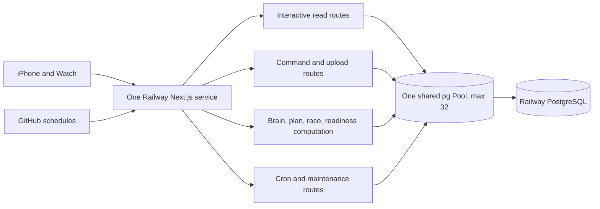

# Whole-backend audit against the live-data master plan

**Date:** 2026-09-15  
**Code baseline:** clean detached `origin/main` at `b6d972fded126cde46f639fcddb21088cd5f81fe`  
**Production evidence:** read-only PostgreSQL inspection on 2026-09-15 plus build-303 device traces already recorded in this folder  
**Scope:** Railway deployment, PostgreSQL, all active `web-v2` API routes and background jobs, coaching owners, projections/caches, iPhone synchronization, Watch execution/upload, observability, migration and release mechanics. The web frontend remains out of scope.

## Plain-English conclusion

The backend has strong coaching rules, substantial domain logic, real account isolation, useful observability, a complete-block plan snapshot, reliable cron bookkeeping, and several purpose-built historical snapshots. It does not yet have the delivery architecture described by the master plan.

The current system still answers many screen requests by rebuilding a large answer live. One app process serves interactive reads, commands, coaching work, imports, and scheduled jobs through one shared PostgreSQL pool. The iPhone has many local refresh and failure mechanisms, and the real shell still starts hidden surfaces. The database has no durable app-state version, no screen-ready bootstrap snapshot, no command receipt chain, and no transactional outbox. There is no foreground version stream. Schema changes are applied manually.

This explains the current behavior without requiring a theory that PostgreSQL is simply too small. The production database reported `max_connections = 500`; the application pool is 32. The post-BA-01 incident showed slow work and client abandonment without contemporaneous pool saturation. Reducing and moving the work is the correct fix.

The plan remains sound, with four corrections:

1. Add **BA-00, migration and workload foundations**, before BA-02. The project cannot safely add three more state tables while migrations remain manual.
2. Treat the remaining launch fan-out and server deadline work as **BA-01R**, a required repair release, not as optional polish.
3. Do not call all existing `*snapshots` tables app read models. They answer different historical coaching questions and remain canonical inputs or derived history.
4. Split BA-02 and BA-03 into small additive releases with dual-read and shadow-build periods. A single cutover would be too broad for 160 routes and the current client graph.

## What was inspected

- 160 active API route files under `web-v2/app/api`.
- 102 GET exports, 97 POST exports, 13 DELETE exports, 11 PATCH exports, and one PUT export. Routes can export more than one method.
- 108 routes with direct source-level `pool.query`, `client.query`, or `pool.connect` use. This is a lower bound because many routes call imported modules that query the database.
- Three routes using the request-scoped memo wrapper: Today, Block, and Races.
- 17 cron route files and 19 scheduled GitHub workflow files.
- 167 iPhone Swift source files and the active Watch synchronization/upload paths.
- 79 migration-related files, including numbered migrations through 171.
- Production table presence, approximate row counts, index counts, extensions, and connection ceiling using read-only queries.
- The governing coaching Constitution, coaching doctrine, clean-implementation rules, architecture brief, implementation sequence, BA-01 changelog/audit, and build-303 device evidence.

Static token counts are inventory evidence, not behavioral proof. They identify audit surfaces; they do not by themselves prove that a write is unsafe or that a route executes every query on every request.

## Current architecture map

The repository is already a modular monolith in code organization. The problem is that the workloads are not separated at runtime or at the database-budget boundary, and interactive read routes often invoke domain computation directly.

## Quantitative production facts

Production currently contains approximately:

| Table | Estimated rows | Approximate total size |
|---|---:|---:|
| `users` | 16 | 104 KB |
| `runs` | 331 | 4.5 MB |
| `races` | 18 | 1.3 MB |
| `training_plans` | 155 | 1.8 MB |
| `plan_weeks` | 584 | 5.4 MB |
| `plan_workouts` | 4,742 | 98.7 MB |
| `health_samples` | 4,402 | 2.3 MB |
| `projection_snapshots` | 737 | 664 KB |
| `readiness_snapshots` | 51 | 160 KB |
| `goal_projection_snapshots` | 50 | 64 KB |
| `request_failures` | 52 | 176 KB |
| `ops_alerts` | 535 | 256 KB |

These figures confirm that present data volume is small. The slow screens are caused by request shape, duplicated computation, scheduling, and delivery design rather than by millions of fact rows.

The database exposes `max_connections = 500`. `pg_stat_statements` is not installed, so production cannot currently provide authoritative per-normalized-query totals and timings from PostgreSQL itself. That is an observability gap, not evidence that queries are healthy.

## What is already good and should be preserved

### Canonical coaching ownership

The Constitution and doctrine define one owner for each coaching decision. The codebase contains concrete owner modules, doctrine gates, mutation registries, runner-state work, a decision-ledger design, and broad falsification tests. BA-02 projections must call and copy these owners. They must not become a new place to calculate fitness, readiness, pace, adaptation, goal feasibility, or race prediction.

### Account scoping

152 of 160 route files contain an obvious authentication, user-resolution, admin, or cron-secret pattern. The eight exceptions are health/public/auth-shaped endpoints. This is a strong baseline. New projection, receipt, event, and lock keys must continue to derive the user from the authenticated server session.

### Correlation and failure evidence

Middleware mints or preserves correlation IDs. `request_failures` exists in production. The phone can later report a request that timed out or received no response using the original correlation ID. The outage helper now records caught-and-returned failures. The architecture should extend this trace across commands, events, jobs, projections, and display acknowledgements instead of replacing it.

### Plan Snapshot and local disk behavior

`PlanSnapshotStore` and `/api/v5/plan-snapshot` prove that a complete-block, versioned, disk-backed object is useful. Covered date navigation can be network-free. This is the correct client experience precedent. The server implementation is too expensive to remain a live read path, but the wire and local-store lessons should feed BA-02.

### Cron ledger

The cron ledger records successful job completion, detects stale jobs, and has a due-based catch-up scheduler. It also documents dependencies and idempotence assumptions. BA-03 should reuse this operational discipline, while moving per-runner state production to a durable event queue.

### Existing derived-history tables

The following are legitimate and should not be renamed into the new app snapshot role:

| Existing object | Real purpose |
|---|---|
| `projection_snapshots` | Daily historical VDOT/race-distance trajectory inputs |
| `goal_projection_snapshots` | Daily trajectory prediction for the next A race |
| `readiness_snapshots` | Daily historical readiness and pillar trend |
| `coach_reads_cache` | Read-through cache for coach-calendar content |
| `PlanSnapshotStore` | Current client-side complete-block cache |

The proposed `app_snapshots` table is different: it packages already-decided current state for fast app display.

## Material gaps

### A. BA-01 is still open

The real shell mounts Today, Block, Races, and Run at the same time and hides unselected tabs with opacity. Their tasks still run. The BA-01 launch test manually invokes only Today and Plan Snapshot, so it cannot detect shell-wide fan-out.

Build 303 showed Today and Races reaching the 12-second client timeout, Block/Plan Snapshot/Watch taking 8.7–11 seconds, a false offline state on active 5G, and Plan Snapshot generation 7. BA-01 removed real redundant calls but did not meet its physical-device completion gate.

Required status: **partial, must repair before architecture work is presented as improving the live app.**

### B. Interactive reads still run the brain

The largest route files are dominated by screen composition and coaching computation:

| Route | Source lines | Direct query call sites in route file | Known behavior |
|---|---:|---:|---|
| `/api/v5/today` | 2,824 | 15 | Documents roughly 35–40 DB round trips through imported resolvers |
| `/api/v5/races` | 661 | 5 | Long sequential race/fitness/outlook/trend chain |
| `/api/v5/block` | 108 | 1 | Calls broader training-state composition |
| `/api/v5/plan-snapshot` | thin route | loader-owned | Loader documents roughly 329 query calls per request |

Plan Snapshot and Races share expensive race-outlook computation. Plan Snapshot's current deadline uses `Promise.race`; it can return while underlying database work continues. That is not cancellation or genuine load shedding.

Required status: **BA-02/BA-03 critical path.**

### C. There is no app-state version or screen-ready read model

Production has no table that owns a monotonic per-runner state version and no table keyed by runner, projection kind, scope, and schema version that stores the current bootstrap/calendar/Today/Block/Races/Watch payload.

Consequences:

- the server cannot cheaply answer “has anything changed?”;
- the phone cannot identify the exact complete server state it is showing;
- every surface has reasons to fetch independently;
- ETag/304 revalidation cannot express domain freshness;
- there is no atomic cross-screen publication boundary.

Required status: **BA-02 not started.**

### D. Schema deployment is manual and production has drift

`web-v2/db/migrations/README.md` explicitly states that migrations are applied by hand. Railway currently builds and starts the app without a pre-deploy migration command.

Read-only production inspection found:

| Migration-backed table | Production state |
|---|---|
| `plan_decision_ledger` (166) | absent |
| `reassessment_schedule` (167) | absent |
| `plan_decision_outcome` (168) | absent |
| `runner_beliefs` (169) | absent |
| `request_failures` (170) | present |

Some code fails closed when these tables are absent, which protects correctness but leaves canonical brain infrastructure unwired. Adding BA-02 and BA-03 tables under the same manual process would expand the drift surface.

Railway supports a pre-deploy command specifically for migrations; it runs after the build and before the new deployment, has service variables/private-network access, and blocks the deployment on a nonzero exit. This should become the migration gate: [Railway pre-deploy command documentation](https://docs.railway.com/deployments/pre-deploy-command).

Required status: **new BA-00 prerequisite.**

### E. Writes lack one receipt/outbox contract

There are 106 route files exporting a mutating HTTP method. Source-level inspection finds idempotency language in only 36 and an obvious transaction token in 13. These counts do not prove the remaining routes are incorrect; helpers and natural unique keys can provide safety. They do prove that idempotency and lifecycle evidence are feature-specific instead of enforced by one command boundary.

There is no `command_receipts` table and no transactional `outbox_events` table. The system therefore cannot answer one query showing:

1. the device command was accepted;
2. the fact committed;
3. the brain processed it;
4. projection version N published;
5. the phone fetched and displayed N.

Required status: **BA-03 not started.**

### F. Workloads share one process and pool

One Railway Next.js service receives interactive reads, commands, Strava callbacks, Watch completions, admin work, cron dispatch, and brain/plan jobs. All normal code imports one `Pool` configured with `max: 32`, a 10-second checkout timeout, and a 30-second statement timeout.

There is no workload reservation that guarantees an interactive projection read a connection while a cron/import/brain pass is active. The cron registry imposes job-level order and time limits but does not create database capacity isolation.

Required status: **BA-00 logical budgets, BA-03 runtime separation.**

### G. Client freshness remains distributed

The iPhone source has freshness/offline/foreground/cache/single-flight behavior spread across `HostsV5.swift`, `SurfaceStoreV5.swift`, `API.swift`, `FaffApp.swift`, `PlanSnapshotStore.swift`, `AppCache.swift`, `ForegroundWork.swift`, Watch synchronization, and older active view stores. A broad source scan produced 1,892 matches across 167 Swift files; the count is intentionally broad, but the concentration confirms that freshness is not owned by one authority.

Timeouts are still promoted into reachability loss. A slow server can therefore generate “offline” copy on a connected phone.

Required status: **BA-01R fixes the lie; BA-05 removes the duplicate machinery.**

### H. No foreground state-version stream

There is an APNs notification system and device-token storage, but no authenticated app-level SSE endpoint that publishes a compact runner state version. There is no broadcaster interface and no client update coordinator that combines SSE, APNs hints, command receipts, foreground entry, and manual refresh.

Required status: **BA-04 not started.**

### I. Watch is robust in parts but not joined to the version chain

The Watch has offline execution, application-context delivery, queued completion relay, and backend duplicate protection work. It does not yet consume the target architecture's accepted, versioned execution packet with a state version, integrity hash, explicit replacement rule, receipt, and downstream projection version.

Required status: **BA-03 receipt first, BA-04/BA-05 packet integration later.**

### J. Operational proof is incomplete

The system records request failures and cron health, but lacks:

- query count and database time per request as a standard route envelope;
- pool wait/active/idle metrics over the full device trace;
- `pg_stat_statements` or an equivalent normalized query view;
- event queue depth and oldest age;
- accepted-fact-to-projection latency;
- current/last displayed state version per app build;
- one runner journey view from command to display.

Required status: **instrument alongside every BA unit, not as a final cleanup.**

## Master-plan scorecard

| Master-plan outcome | Current grade | Evidence | Required unit |
|---|---|---|---|
| Useful screen immediately | D | Valid disk cache exists, but hidden surfaces and slow reads still block/fail | BA-01R, BA-02, BA-05 |
| Displayed truth identifiable | D+ | Plan version/generation exist in parts; no whole-app state version | BA-02 |
| Converges quickly after new evidence | C- | Many triggers exist; no durable event-to-projection SLA | BA-03, BA-04 |
| Normal use cannot overload system | D | BA-01 reduced demand, but build 303 still produced 8.7–12s reads | BA-01R, BA-02 |
| Brain decides once | C | Strong doctrine owners, but screen routes still invoke them live | BA-02, BA-03 |
| Writes provable end to end | D | Feature-specific logs, no common receipt/outbox/display chain | BA-03 |
| Multi-user-ready contracts | C+ | Strong user scoping; no fairness/version/queue contract yet | BA-00, BA-03 |
| Quiet, truthful failure | D | Last-good behavior exists, but timeout still becomes offline | BA-01R, BA-05 |
| Build for scale without buying it | B- design / D+ runtime | Modular monolith is suitable; runtime boundaries absent | BA-00 through BA-04 |

## Corrected programme sequence

```mermaid
flowchart LR
    A[BA-01R: finish incident] --> B[BA-00: migrations, budgets, metrics]
    B --> C[BA-02A: versions and projection store]
    C --> D[BA-02B: shadow builders and parity]
    D --> E[BA-02C: bootstrap API and client store]
    E --> F[BA-03A: receipts and outbox]
    F --> G[BA-03B: per-runner worker]
    G --> H[BA-03C: migrate high-value writes]
    H --> I[BA-04: SSE and APNs version hints]
    I --> J[BA-05: surface migration and deletion]
```

BA-00 can be implemented in parallel with BA-01R only if it does not touch the frozen launch/read files. BA-02 must not be used to avoid repairing the live TestFlight behavior.

## Decisions already settled

- Railway remains the active host.
- Cloudflare remains out of scope.
- The production shape stays a modular monolith.
- Scale-ready contracts target 1,000 actively interacting runners, 5,000 mostly idle live device connections, and a 2,000-runner burst.
- Current production stays at present-demand capacity. No new service, replica, larger tier, Redis, or other recurring spend is enabled without David's approval.
- Existing and immediately previous app builds receive one explicit compatibility window.
- The web frontend remains ignored.
- Projections package canonical answers; they never create coaching truth.

## Audit disposition

The architecture brief is approved as the target direction after incorporating BA-00 and the smaller release boundaries above. The next implementation should follow `BACKEND-IMPLEMENTATION-SCOPE-AND-SETUP-2026-09-15.md`, with every release pinned to an exact SHA and independently reviewed.
